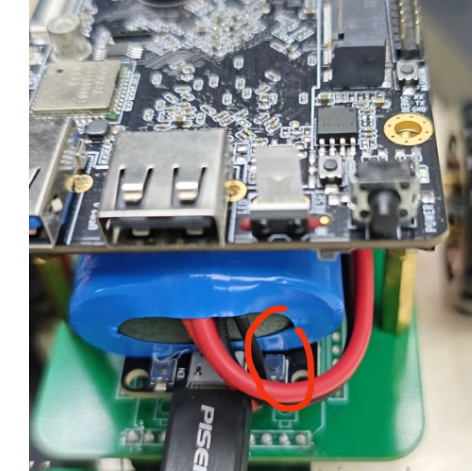
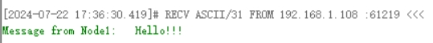

# 车辆核心网Demo

V1.0：设计了循迹、配网、udp控制和RK板子供电

    待改进：
1. 引脚分配问题，上电时轮子会转1s
2. 连接主机IP地址修改麻烦
3. 未引入速度控制，低电量可能运行不稳定（低速低电量轮子可能不转）

## 使用说明
### 1、连接网络
如需更改连接的网络，长按此按键2s
 <!-- 此路径表示图片和MD文件，处于同一目录 -->
然后微信搜索乐鑫信息科技公众号-产品资源-Air kiss设备，按提示操作，注意手机尽可能靠近小车，即可向小车发送wifi信息
### 2、创建udp服务端并控制
main中定义的UDP远程IP地址和端口如下
```
#define HOST_IP_ADDR "192.168.1.110"
#define PORT 3333
```
小车上电后会连接此端口并发送信息，可根据信息得知小车的节点号及ip地址、端口号
下图使用网络调试助手监听后收到的信息，来自192.168.1.108，端口61219
 <!-- 此路径表示图片和MD文件，处于同一目录 -->
向其发送`Node1`即可启动小车


## 代码说明
### 流程简介
上电首先进行wifi连接，连接成功后开启黑线检测任务和udp监听任务
1. udp监听控制指令，校验成功则将小车从静止状态切换到巡线状态
2. 巡线状态可沿着不太复杂的黑线前进，当多个传感器（>=3）检测到黑线，会掉头并回到状态1，等待下一次控制指令

PC端可一直发送控制指令，小车会自行循环往返近端和远端。需注意电量不足时可能不能稳定运行
### 具体介绍
1. 在main.c->app_main中
```
//以下用于网络连接，一般不用改
ESP_ERROR_CHECK( nvs_flash_init() );
initialise_wifi();//智能配网

button_init(0);//按键长按事件，清除WiFi信息

ESP_ERROR_CHECK(esp_netif_init());//初始化UDP连接

//以下用于硬件初始化，一般不用改
temp_ntc_init();//初始化ADC用于循迹，最多支持6路，现使用4路
MoterInit();//电机初始化，State置0关闭电机

//创建UDP监听事件
xTaskCreate(udp_client_task, "udp_client", 4096, NULL, 5, NULL);
//延时等待系统稳定
vTaskDelay(pdMS_TO_TICKS(1000));

//底下的while（1）用于调试无实际意义
```
2. MYpwm.h用于电机运动控制

```

int MoterInit(void);//电机初始化

int SetSpeed(int Left,int Right);//设置左右轮速度
//!!!!!!!由于没有加入速度控制，目前大概测得左3000右2000能直走，但后续可能修改 

//状态说明
//  0:电机停止  收到正确的udp包 ->1
//  1:正常巡线  遇到横着的黑线  ->2
//  2：原地旋转半秒            ->3
//  3:继续旋转直到检测到黑线    ->1
int NowState(void);//返回当前状态
int SetState(int state);//设置当前状态
```
### 3. **ntc.c：主要修改的地方**
   
```
void temp_ntc_init(void);//ADC初始化，用于巡线，此函数会创建一个Task不断读取ADC的结果，一般不用修改

int My_Fix_line(void);//将读取的ADC结果进行判断，是否为黑线，目前使用的阈值为20，大于20认为是黑线

int* get_temp(void);//返回ADC的识别结果，通过修改return返回的数组，查看原始数据和黑线判断数据，调试用
```

**检测黑线失败，或者需要调整巡线阈值时**
1. 修改My_Fix_line的返回值，先查看原始ADC数据
2. 在main函数里面打开while(1)的
   `ESP_LOGI(TAG,"V=%d\t%d\t%d\t%d\t%d\t%d\t",Vint_pointer[0]...`
3. 在串口中查看阈值应该设为多少，修改My_Fix_line阈值
4. 修改My_Fix_line的返回值，先查看判断后数据
5. 检查无问题，关闭main的打印函数，不要乱发

**巡线模式逻辑**
1. temp_adc_task中不断读取ADC的值，均值滤波，阈值判断
2. 判断几个传感器检测到黑线，如果在巡线模式(State 1) 黑线大于等于3进入State 2，否则State 0停车等待UDP指令
3. 否则根据黑线位置控制电机差速巡线，**可能需要调整差速数值！！！**
4. 如果进入State 2，前方三个以上传感器检测到黑线，先原地旋转500ms离开黑线，进入State 3
5. 进入State 3，继续旋转直到指定传感器检测到黑线，防止电量低转弯时间变长，回到State 0
6. 等待UDP指令进入State 1


### 4. UDP监听事件（main.c）
udp_client_task中连接指定主机，IP地址、端口定义在开头
While(1)循环中，一直给主机发消息告知单片机的ip地址和端口，本文使用NetAssist进行PC端监听，一般般不是很好用
如果收到消息，对比收到的消息是否为“Node1”，是则进入State 1
此处使用1s延时，但是实际上好像延时了5s，但是能用就没管


## 硬件说明
**基本的小车运动和板卡供电已满足，场地需求较为简单，但长距离巡线能力存疑**
**不足**
1. 巡线范围有点窄，可能会偏离
2. 开机会转个1s，后续尝试解决，可能是引脚上拉的问题，烧录代码也会一直转，考虑换个引脚或者加入电机使能
3. **没有做速度控制PID，考虑到是过度版本，以及ESP32不知道有没有编码器模式，后续看看反馈**
4. 没有预留足够的电池位置，重心靠后，加速容易后仰
5. **场地没有确定，不确定是不是使用巡线模块，后续可能是智能车的摄像头，所以还没做动态阈值**

后续安装到智能车上存在的问题
1. 智能车算法设计速度在1-2m/s，可能有点快
2. 赛道要求更加复杂
3. 需要4辆车，安装调试成本比较大，目前不同组别的车加起来应该是三辆，但是结构和代码都不一样，需要在原本的逻辑中加入控制算法，最好是一辆车复制4份
